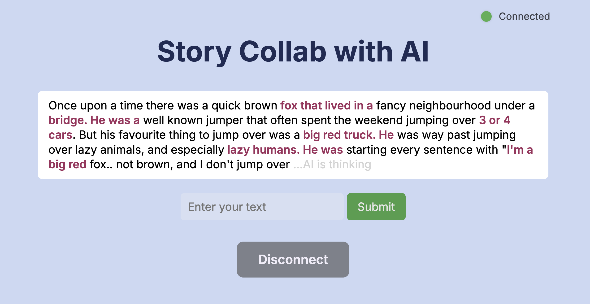

# llm-story-collab

This web app allows users to co-write a story with an AI language model, taking turns with the AI to build a shared narrative. Users can download their preferred language model from Hugging Face's library, and inference will be performed using the [Transformers Pipelines](https://huggingface.co/docs/transformers/v4.45.2/en/main_classes/pipelines#pipelines). 

### Technologies
- **Frontend**: Svelte (for building and serving the single-page app), JavaScript, SCSS, and HTML
- **Backend**: Python (for writing a WebSocket server)
- **Containerization**: Docker (for packaging and deploying the application)

## Installation


1. Clone the repository:
   ```bash
   git clone https://github.com/akselkristoffersen/llm-story-collab.git
   cd llm-story-collab
2. Install huggingface_hub
   ```bash
   pip install huggingface_hub
3. Set Environment Variables
* $HF_HOME: The directory where Hugging Face models will be stored.
* $AX_MODEL_NAME: The name of the model on Hugging Face that you want to use.
    ```bash
    export HF_HOME=/path/to/your/huggingface/models
    export AX_MODEL_NAME=huggingface-model-name
4. Download the Model
    ```bash
    huggingface-cli download $AX_MODEL_NAME
5. Install Docker

    If you haven't installed Docker yet, download and install it from [Docker's official website](https://www.docker.com/get-started/).
6. Run Docker Compose
    ```bash
    docker-compose up
7. Open in Web Browser http://localhost:80


